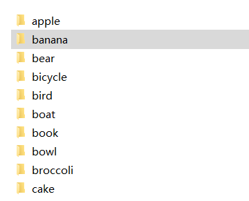
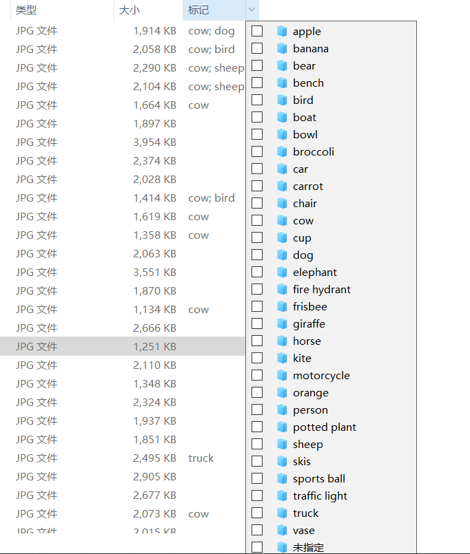

#

功能: 对以前拍的照片分类

## RUN

Need install package

1. torch
2. pillow

Run

```sh
python ./image_class.py --files="./input" --outPut="./out" --addKey=True --device="gpu"
```

## Example




## TODO

相似图片归类

重新训练,增加准确度

## Other

由于  `hMatoba/Piexif` 存在一个bug 所以采用文件引用. <https://github.com/hMatoba/Piexif/issues/130>
